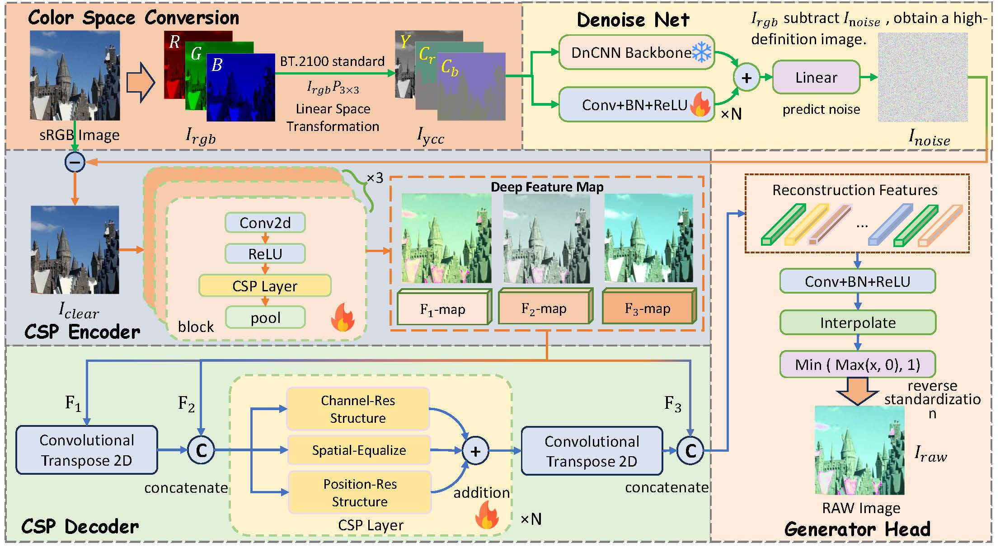

<div align="center">

# AURA: YCbCr-Based Universal RAW-Reconstruction 

# for Inverse ISP

 

<div align="center">

This is the official repository for **AURA**.


</div>

</div>


## :bulb: Inverse ISP in YCbCr  color space

* 🚩  We propose AURA, a parameter-agnostic inverse ISP framework leveraging **YCbCr** perceptual decoupling for cross-device generalization. 

* 🚩  We design a **CSP module** performing multi-dimensional residual fusion to recover lost ISP details. 
* 🚩  We introduce a **noise-aware composite loss** enforcing stronger constraints on difficult regions for higher-fidelity RAW reconstruction. 





##  :hourglass: Environment

* We use python==3.10 and pytorch >= 2.5.1  with CUDA version 12.4
* Running in a NVIDIA GeForce RTX 3080 GPU
* Create environment:

```python
conda create --name isp python=3.10
conda activate isp
```

* Install the corresponding version pytorch:

```python
conda install pytorch==1.13.1 torchvision==0.14.1 torchaudio==0.13.1 pytorch-cuda=12.1 -c pytorch -c nvidia
```

* Install other dependency packages:

```python
pip install -r requirements.txt
```


##  :clipboard: Dataset Preparation

* **RGB2RAW**: iPhoneX, SamsungS9, Samsung21[download](https://huggingface.co/datasets/marcosv/rgb2raw).These images are taken from different scenes captured by the iPhone X, Samsung S9, and Samsung 21 cameras. This dataset consists of 2952 pairs of ultra-high resolution images used for model training and a validation set of 120 pairs of images.

* **RAW-NOD**: Sony RX100 VII and Nikon D750 [download](https://github.com/igor-morawski/RAW-NOD).A high-quality dataset collected by professional DSLR cameras Sony RX100 VII and Nikon D750, containing 7K RAW sRGB image pairs.

* **ETH Huawei P20**: 《Replacing Mobile Camera ISP with a Single Deep Learning Model》[link](https://people.ee.ethz.ch/~%cb%9cihnatova/pynet.html).Contains RAW sRGB image pairs captured by Huawei P20 smartphones, covering complex scenes such as indoor and outdoor, high and low light, dynamic blur, etc., with a unified resolution of 3024 × 4032.


##  :white_check_mark: How to Run

* Firstly, use our code to convert sRGB to YCbCr.

```python
cd YCrCb/code
python rgb2ycc.py # Please ensure that your path is correct
```


* Please download the dataset in advance and modify the relative paths in the code.
* Please prepare an environment such as pytorch in advance. You can use the following commands for inference: 

```cmd
python inference.py --folder test/ --output results/
```
